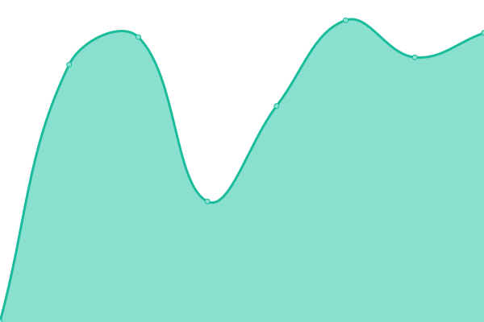
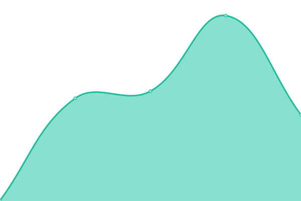
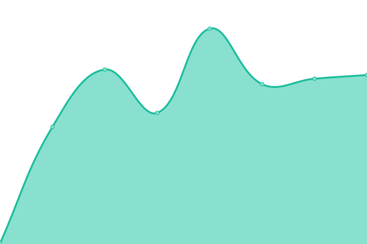
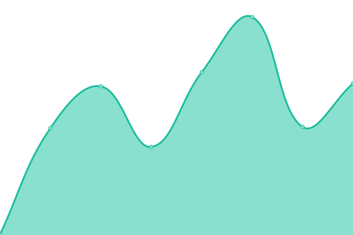
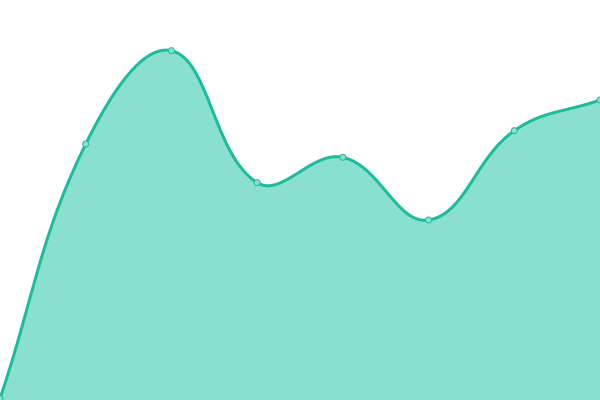

# [📈 Live Status](https://status.kord.dev): <!--live status--> **🟩 All systems operational**

This repository contains the open-source uptime monitor and status page for [Kord](https://kord.dev), powered by [Upptime](https://github.com/upptime/upptime).

With [Upptime](https://upptime.js.org), you can get your own unlimited and free uptime monitor and status page, powered entirely by a GitHub repository. We use [Issues](https://github.com/kordlib/status/issues) as incident reports, [Actions](https://github.com/kordlib/status/actions) as uptime monitors, and [Pages](https://status.kord.dev) for the status page.

<!--start: status pages-->
<!-- This summary is generated by Upptime (https://github.com/upptime/upptime) -->
<!-- Do not edit this manually, your changes will be overwritten -->
<!-- prettier-ignore -->
| URL | Status | History | Response Time | Uptime |
| --- | ------ | ------- | ------------- | ------ |
|  [Maven Repository](https://repo.kord.dev) | 🟩 Up | [maven-repository.yml](https://github.com/kordlib/status/commits/HEAD/history/maven-repository.yml) | 

 428ms
     
 | 

<a href="https://status.kord.dev/history/maven-repository">100.00%</a>
    

|  [Storage Bucket](https://kord-snapshots.fra1.cdn.digitaloceanspaces.com) | 🟩 Up | [storage-bucket.yml](https://github.com/kordlib/status/commits/HEAD/history/storage-bucket.yml) | 

 90ms
     
 | 

<a href="https://status.kord.dev/history/storage-bucket">100.00%</a>
    

|  [Codegen.kt Wiki](https://codegen.kord.dev) | 🟩 Up | [codegen-kt-wiki.yml](https://github.com/kordlib/status/commits/HEAD/history/codegen-kt-wiki.yml) | 

 147ms
     
 | 

<a href="https://status.kord.dev/history/codegen-kt-wiki">100.00%</a>
    

|  [Kord Dokka](https://dokka.kord.dev) | 🟩 Up | [kord-dokka.yml](https://github.com/kordlib/status/commits/HEAD/history/kord-dokka.yml) | 

 163ms
     
 | 

<a href="https://status.kord.dev/history/kord-dokka">100.00%</a>
    

|  [Cache library Dokka](https://cache.dokka.kord.dev) | 🟩 Up | [cache-library-dokka.yml](https://github.com/kordlib/status/commits/HEAD/history/cache-library-dokka.yml) | 

 140ms
     
 | 

<a href="https://status.kord.dev/history/cache-library-dokka">100.00%</a>
    

|  [kordx.emoji Dokka](https://emoji.dokka.kord.dev) | 🟩 Up | [kordx-emoji-dokka.yml](https://github.com/kordlib/status/commits/HEAD/history/kordx-emoji-dokka.yml) | 

 120ms
     
 | 

<a href="https://status.kord.dev/history/kordx-emoji-dokka">100.00%</a>
    

<!--end: status pages-->

[**Visit our status website →**](https://status.kord.dev)

## 📄 License

- Powered by: [Upptime](https://github.com/upptime/upptime)
- Code: [MIT](./LICENSE) © [Anand Chowdhary](https://anandchowdhary.com), supported by [Pabio](https://pabio.com)
- Data in the `./history` directory: [Open Database License](https://opendatacommons.org/licenses/odbl/1-0/)
